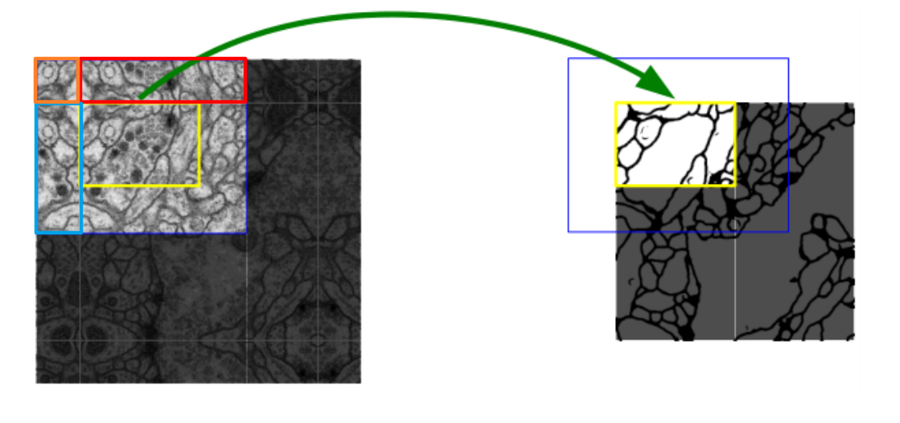

# Semantic Segmentation of Pathological Images

[TOC]

## 其他文档

[2019肾小球数据集分割实验记录](http://gitlab.local/tangwenqi/semantic-segmentation-of-pathological-images/issues/1)

[病理图像语义分割数据集收集](http://gitlab.local/tangwenqi/semantic-segmentation-of-pathological-images/issues/2)

## 分割算法

### UNet

- [x] [UNet](https://arxiv.org/abs/1505.04597)
- [x] UNet with ResNet as encoder
- [ ] UNet with DenseNet as encoder
- [x] [UNet++](https://arxiv.org/abs/1807.10165)
- [ ] [Attention UNet](https://arxiv.org/abs/1804.03999)
- [ ] [R2UNet(Recurrent Residual UNet)](https://arxiv.org/abs/1802.06955)

## 其他

### Metrics

- PA，MPA，MIoU，FWIoU，DSC（Dice similar coefficient）
- https://www.cnblogs.com/Trevo/p/11795503.html

### 损失函数

- Dice Loss
- CrossEntropyLoss
- BCELoss（二元交叉熵，专门用于二分类），其输入一般是经过sigmoid计算的概率（不是softmax）
- 考虑病理图像中背景样本数量远远多于前景样本，造成类别不平衡，可以通过在Loss中，给不同类别的Loss加劝
- https://www.aiuai.cn/aifarm1330.html

### 图像预处理方法

- 直方图均衡（Histogram Equalization），增强对比度

### 图像边缘分割优化

- 对原图的边缘进行镜像padding来丰富边缘的图像信息，类似于UNet中的方案

### 后端优化

- CRF/MRF，https://zhuanlan.zhihu.com/p/22308032

  预测输出中，存在着不同类别混合在一起的情况
